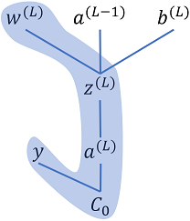
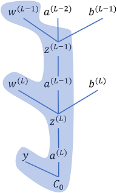
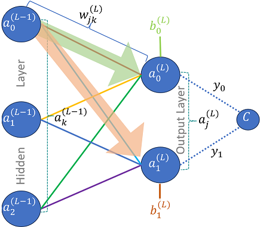

Referring to the network as shown in figure 1, we would like to determine the weights and the biases for the complete network such that the difference between the desired output and the network output is minimized. If this sounds familiar, it is because we did exactly this in gradient descent earlier. However, we used an example of a single function such the difference between the desired output and the function output was minimized. 

A neural network is also a function, but a little more complex than the functions that we dealt with earlier. The complexity arises due to the structure of a neural network consisting of layers, with each layers containing multiple neurons and each layer connected with the other layer through weights. We would like to find the weights and biases for the whole network using gradient descent. Though, the principal to minimize the function and executing the gradient descent still stays exactly the same but parsing the whole network and figuring out the individual weights and biases becomes a little involved. This is where back propagation comes in and we combing both gradient descent and back propagation to optimize the function for neural network.

Fig. 1: Three Layers Neural Network

Gradient descent is given as follows

Repeat{

$$\theta_j := \theta_j - \alpha \frac{\partial}{\partial \theta_j} J(\theta)$$

}

However, instead of $\theta$ we would be optimizing for weights $w$ and biased $b$.

We need to find the gradient of the cost function of the entire network $\Delta C$, which is done using back propagation. The cost gradient vector is given as follows

$$
\Delta C = \begin{bmatrix}
\frac{\partial C}{\partial w^{(1)}}
\\ 
\frac{\partial C}{\partial b^{(1)}}
\\ 
\vdots 
\\ 
\frac{\partial C}{\partial w^{(L)}}
\\ 
\frac{\partial C}{\partial b^{(L)}}
\end{bmatrix}
$$

where $C$ is the total cost, e.g., mean square error between desired output and the network output. $w^{(L)}$ is the weight matrix of layer $L$ and $b^{(L)}$ is the bias vector of layer $L$. Hence, the gradient vector, $\Delta C$, are the partial differentials of cost w.r.t. each weight in layer 1 and biases in layer 1 and the next layer, up until the last layer.

This is exactly how we performed the optimization in simple gradient descent, i.e., we find partial differentials the cost function $J(\theta)$ w.r.t. the independent variable $\theta$. In this case, we has the possibility of changing the weights $w$ and biases $b$.

# Computing the cost of a single training sample

We would be using the reference network as shown in figure 1 with two output neurons, three hidden layer neurons and two input neurons. Initial formulation would be based on this network to give a concrete example to the reader, however, the derivation would still be generic and could be used for network of any size.

Dataset consists of input-output pairs ${(\overrightarrow{x_i}, \overrightarrow{y_i})}$, where $\overrightarrow{x_i}$ is the input and $\overrightarrow{y_i}$ is the desired output of the network. The dataset consists of $N$ input-output pairs.

Let us first define some properties and notations for convenience. The cost of training a single example $C_0$ can be given as follows

$$C_0 = \sum_{j=0}^{n_L-1}(a_j^{(L)}-y_j)^2\label{eq:costZero}$$

where $a_j^{(L)}$ is the $j^{th}$ activation function of layer $L$ and $y_j$ is the $j^{th}$ desired output. We will handle the multiple samples towards the end of the derivation, till then we will assume training with only one sample and the corresponding cost would be $C_0$ to keep the derivation relatively simple and avoid unnecessary complication.

## Computing the Gradient for Output Layer

    

Let us first focus only on the output layer. We would use the results from output layer to compute the cost function. Afterwards, we would compute the gradients for each neuron in the output layer. For convenience sake, lets assume the activation function is sigmoid (already implemented in [logistic regression](./LogisticRegression.md)). But, don't worry, as the derivation will still be generic and agnostic to the activation function used. However, this assumption allows us to generate intermediary derivation steps to show concrete results for differentiation of activation function instead of scary looking partial differential symbols. Hence, the activation of $j^{th}$ neuron in layer $L$ can be given as 

$$a_j^{(L)} = \sigma (w_{j0}^{(L)}a_0^{(L-1)} + w_{j1}^{(L)}a_1^{(L-1)} + w_{j2}^{(L)}a_2^{(L-1)} + b_j^{(L)})$$

Again for simplification we would name the expression inside the sigmoid as follow

$$z_j^{(L)} = w_{j0}^{(L)}a_0^{(L-1)} + w_{j1}^{(L)}a_1^{(L-1)} + w_{j2}^{(L)}a_2^{(L-1)} + b_j^{(L)}$$ 

or generically,

$$z_j^{(L)} = \sum_{k=0}^{n_{(L-1)}-1}w_{jk}^{(L)}a_k^{(L-1)} + b_j^{(L)}\label{eq:zLastLayer}$$

Hence,

$$a_j^{L} = \sigma (z_j^L)$$

In order to visualize this in terms of the actual operations taking place, we can represent them as matrix operations

$$\large{
\begin{bmatrix}
z_0^L
\\ 
z_1^L
\end{bmatrix}
=
\begin{bmatrix}
w_{00}^{(L)} & w_{01}^{(L)} & w_{02}^{(L)}\\ 
w_{10}^{(L)} & w_{11}^{(L)} & w_{12}^{(L)}
\end{bmatrix}
\begin{bmatrix}
a_0^{(L-1)}\\ 
a_1^{(L-1)}\\ 
a_2^{(L-1)}
\end{bmatrix}
+
\begin{bmatrix}
b_0^{(L)}\\ 
b_1^{(L)}
\end{bmatrix}}
$$

### Optimizing w.r.t. the weights for the output layer

As we already discussed we have the possibility of changing the weights and biases in the network. Hence, first we would like to see how the change in the weights affects the cost. Once, we have determined the change (or the gradient) due to the weights.

    

Fig 2: Cost dependency chain w.r.t. output layer weights  
                
As the cost does not *directly* depend on the weights, hence we will use the chain rule to determine the partial derivative of the cost w.r.t. the weights. Please refer to Fig. 2 to visualize how the chain rule is being applied. Cost $C_0$ depends on the activation output $a_j^{(L)}$, the activation output depends on the $z_j^{(L)}$, which in turn depends on the weight $w_{jk}^{(L)}$. The partial derivative of cost, $C_0$, w.r.t. to a single weight of layer $L$, $w_{jk}^{(L)}$ would be given as follows

$$\frac{\partial C_0}{\partial w_{jk}^{(L)}} = \frac{\partial C_0}{\partial a_j^{(L)}} \frac{\partial a_j^{(L)}}{\partial z_j^{(L)}}\frac{\partial z_j^{(L)}}{\partial w_{jk}^{(L)}}$$

Now, we can solve each of the three partial derivatives. Using eq. \ref{eq:costZero}, we can solve the first part as follows

$$\frac{\partial C_0}{\partial a_j^{(L)}}=\frac{\partial }{\partial a_j^{(L)}}\sum_{j=0}^{n_L-1}(a_j^{(L)}-y_j)^2 = 2(a_j^{(L)}-y_j)\label{eq:costZeroWRTAct}$$

This is trivially computable, as it is just twice the difference between the activation value and th desired output.

Next, part of the equation is simply the differential of activation function w.r.t. the $z$. However, to find a concrete solution, we will assume the used activation function is sigmoid (if any other function like ReLu is used, the differential needs to be replaced accordingly). Hence, the partial derivative would be as follows:

$$\frac{\partial a_j^{(L)}}{\partial z_j^{(L)}}=\frac{\partial }{\partial z_j^{(L)}}\left ( \frac{1}{1+e^{-z_j^{(L)}}} \right )=a_j^{(L)}(1-a_j^{(L)})\label{eq:actWRTZSigmoid}$$

The derivative of logistic function is the [function multiplied by one minus the function](https://en.wikipedia.org/wiki/Logistic_function#Derivative). The values above is very simple to compute.

Finally, we have the last part of the equation. It can easily be computed using the definition of $z$ from eq. \ref{eq:zLastLayer}. The derivative would be

$$\frac{\partial z_j^{(L)}}{\partial w_{jk}^{(L)}}=a_k^{(L-1)}\label{eq:ZWRTWeights}$$

Combining the results from eq. \ref{eq:costZeroWRTAct} - \ref{eq:ZWRTWeights} we have a very simple solution for the cost function gradient w.r.t. the weights as follows:

$$\boxed{\colorbox{Chartreuse}{$\frac{\partial C_0}{\partial w_{jk}^{(L)}} =2(a_j^{(L)}-y_j) a_j^{(L)}(1-a_j^{(L)}) a_k^{(L-1)}\label{eq:costZeroWRTWeights}$}}$$

or generically, if we don't want to make assumption about the activation function:

$$\frac{\partial C_0}{\partial w_{jk}^{(L)}} =2(a_j^{(L)}-y_j) \frac{\partial a_0^{(L)}}{\partial z_j^{(L)}} a_k^{(L-1)}$$

We will introduce an additional notation, $\delta_j^{(L)}$ referred to as error term, as it will be very useful later on.

$$\delta_j^{(L)}=\frac{\partial C_0}{\partial a_j^{(L)}} \frac{\partial a_j^{(L)}}{\partial z_j^{(L)}} = 2(a_j^{(L)}-y_j) \frac{\partial a_j^{(L)}}{\partial z_j^{(L)}}\label{eq:deltaDef}$$

In case of sigmoid activation function, using \ref{eq:actWRTZSigmoid} delta would be

$$\delta_j^{(L)}= 2(a_j^{(L)}-y_j) a_j^{(L)}(1-a_j^{(L)})$$

Hence,

$$\boxed{\colorbox{Chartreuse}{$\frac{\partial C_0}{\partial w_{jk}^{(L)}} =\delta_j^{(L)} a_k^{(L-1)}$}}\label{eq:gradientZeroLayerWeights}$$

### Optimizing w.r.t. biases for the output layer

As we have already discussed, the cost function is affected by the weights, the activation function value from the previous layer and the biases. We have already derived the solution for the cost gradient w.r.t. weights. Next, we will address the biases. Fortunately, it is relatively very simple.

    

Fig 3: Cost dependency chain w.r.t. output layer biases  

Referring to Fig. 3, we can apply chain rule to find the cost gradient w.r.t. biases

$$\frac{\partial C_0}{\partial b_{j}^{(L)}} = \frac{\partial C_0}{\partial a_j^{(L)}} \frac{\partial a_j^{(L)}}{\partial z_j^{(L)}}\frac{\partial z_j^{(L)}}{\partial b_{j}^{(L)}}\label{eq:costZeroLayerLWRTBias}$$

We already have got the results for the first two parts of the Eq. \ref{eq:costZeroLayerLWRTBias} in Eq. \ref{eq:costZeroWRTAct} and Eq. \ref{eq:actWRTZSigmoid}. Before proceeding any further we can simplify the above equation using the definition of error term from Eq. \ref{eq:deltaDef} as follows:

$$\frac{\partial C_0}{\partial b_{j}^{(L)}} = \delta_j^{(L)} \frac{\partial z_j^{(L)}}{\partial b_{j}^{(L)}}\label{eq:costZeroLayerLWRTBiasDelta}$$

Now, we can compute the partial differential using the definition of $z_j^{(L)}$ from Eq. \ref{eq:zLastLayer}:

$$ \frac{\partial z_j^{(L)}}{\partial b_{j}^{(L)}}  = \frac{\partial }{\partial b_{j}^{(L)}} \sum_{k=0}^{n_{(L-1)}-1}w_{jk}^{L}a_k^{(L-1)} + b_j^{(L)} = 1$$

It is conveniently "1", hence the cost gradient w.r.t. biases is just the error term:

$$\boxed{\colorbox{Chartreuse}{$\frac{\partial C_0}{\partial b_{j}^{(L)}} = \delta_j^{(L)}$}}\label{eq:gradientBiasLayerZero}$$

### Milestone

We have computed the cost gradients w.r.t. the weights and biases of the output layer using Eq. \ref{eq:gradientZeroLayerWeights} and \ref{eq:gradientBiasLayerZero}. We don't explicitly compute the cost gradient w.r.t. activation function, because it is not the quantity that we can change directly, rather we change the weights and biases, which in effect changes the activations. Hence, we would now move on to the next layer, i.e., the hidden layer.

## Computing the Gradient for Hidden Layer

The cost gradient computation for hidden layer is relatively simple as most of the ground work has already been laid out. However, it is going to be a little cluttered before we can clean up the clutter and come up with a relatively clean and simple solution.

    

Fig 4: Cost dependency chain w.r.t. hidden layer weights

Cost gradient computation for hidden layer follows the same sequence of computations as earlier, i.e., compute the cost gradient w.r.t. the weights and biases of the hidden layer. Fig. 4 shows the dependency chain for the weights.

### Optimizing w.r.t. the weights for the hidden layer

The cost gradient w.r.t. to the weights of the hidden layer can be given as follows

$$\frac{\partial C_0}{\partial w_{kl}^{(L-1)}} = \frac{\partial C_0}{\partial a_j^{(L)}} \frac{\partial a_j^{(L)}}{\partial z_j^{(L)}} \frac{\partial z_j^{(L)}}{\partial a_k^{(L-1)}} \frac{\partial a_k^{(L-1)}}{\partial z_k^{(L-1)}} \frac{\partial z_k^{(L-1)}}{\partial w_{kl}^{(L-1)}}$$

    

Fig 5: Hidden Layer activation function output impact on output layer

Referring to Fig. 5, we can see that activation function output from each neuron is hidden layer feeds into each neuron of the next layer (or output layer in this specific case), as can be seen by the green and orange arrows in the figure. Hence, each output affects multiple neurons in the next layer, hence we have to account for this effect. The last equation needs to be updated accordingly. However, initially we will write cost gradient for activation function output $a_0^{(L-1)}$ and generalize it afterwards. Here is the specific equation

$$\frac{\partial C_0}{\partial w_{kl}^{(L-1)}} = 
\colorbox{#90EE90}{$\frac{\partial C_0}{\partial a_0^{(L)}} \frac{\partial a_0^{(L)}}{\partial z_0^{(L)}} \frac{\partial z_0^{(L)}}{\partial a_0^{(L-1)}} \frac{\partial a_0^{(L-1)}}{\partial z_0^{(L-1)}} \frac{\partial z_0^{(L-1)}}{\partial w_{kl}^{(L-1)}}$}
+ \\
\colorbox{#FFD8B1}{$\frac{\partial C_0}{\partial a_1^{(L)}} \frac{\partial a_1^{(L)}}{\partial z_1^{(L)}} \frac{\partial z_1^{(L)}}{\partial a_0^{(L-1)}} \frac{\partial a_0^{(L-1)}}{\partial z_0^{(L-1)}} \frac{\partial z_0^{(L-1)}}{\partial w_{kl}^{(L-1)}}$}
$$

We can easily generalize this equation as follows:

$$\frac{\partial C_0}{\partial w_{kl}^{(L-1)}} = \left( \sum_{j=0}^{n_L-1}
\colorbox{#5DADE2}{$\frac{\partial C_0}{\partial a_j^{(L)}} \frac{\partial a_j^{(L)}}{\partial z_j^{(L)}} $}
\frac{\partial z_j^{(L)}}{\partial a_k^{(L-1)}}  \right)
\frac{\partial a_k^{(L-1)}}{\partial z_k^{(L-1)}} \frac{\partial z_k^{(L-1)}}{\partial w_{kl}^{(L-1)}}$$

Let us focus on the term highlighted in color in the above equation, it is error term as defined in Eq. \ref{eq:deltaDef}. We can simplify the above equation by replacing the two terms with error as follow:

$$\frac{\partial C_0}{\partial w_{kl}^{(L-1)}} = 
\left( \sum_{j=0}^{n_L-1} \delta_j^{(L)} \frac{\partial z_j^{(L)}}{\partial a_k^{(L-1)}} 
 \right)
\frac{\partial a_k^{(L-1)}}{\partial z_k^{(L-1)}} \frac{\partial z_k^{(L-1)}}{\partial w_{kl}^{(L-1)}} \label{eq:hiddenLayerWRTWeights}
$$

We already have the results for the last partial derivatives factor in Eq. \ref{{eq:ZWRTWeights}}. Hence, the above formula would simplify to the follow:

$$\frac{\partial C_0}{\partial w_{kl}^{(L-1)}} = 
\left( \sum_{j=0}^{n_L-1} \delta_j^{(L)} \frac{\partial z_j^{(L)}}{\partial a_k^{(L-1)}} 
 \right)
\frac{\partial a_k^{(L-1)}}{\partial z_k^{(L-1)}} a_{l}^{(L-2)}
$$

The last remaining factor partial derivative can be computed as follows, using the definition of $z$ from Eq. \ref{eq:zLastLayer}:

$$ \frac{\partial z_j^{(L)}}{\partial a_k^{(L-1)}} = \frac{\partial }{\partial a_k^{(L-1)}} \sum_{k=0}^{n_{(L-1)}-1}w_{jk}^{(L)}a_k^{(L-1)} + b_j^{(L)} = w_{jk}^{(L)} $$

<!---
and we would replace the $\frac{\partial a_k^{(L-1)}}{\partial z_k^{(L-1)}}$ with short form derivative, however, if sigmoid is to be considered as the activation function the derivative can be replaced with the results from Eq. \ref{eq:actWRTZSigmoid}. However, we will keep the derivative generic, as we want to keep the derivation agnostic to any specific assumptions. -->

Hence, the cost gradient equation simplified further to the following

$$\boxed{\colorbox{Chartreuse}{$\frac{\partial C_0}{\partial w_{kl}^{(L-1)}} = 
\left( \sum_{j=0}^{n_L-1} \delta_j^{(L)} w_{jk}^{(L)}  \right)
\frac{\partial a_k^{(L-1)}}{\partial z_k^{(L-1)}} a_{l}^{(L-2)}$}}$$

We have also solved the last remaining partial fraction in the above equation earlier in Eq. \ref{eq:actWRTZSigmoid} for sigmoid. Hence, if the neuron uses the sigmoid we can readily replace the partial fraction with this result, otherwise the derivative of the corresponding activation function must be used.

Compare this results with Eq. \ref{eq:gradientZeroLayerWeights}, it is essentially the same. Hence, we define the error term for the hidden layers as follows

$$\delta_k^{(L-1)} = 
\left( \sum_{j=0}^{n_L-1} \delta_j^{(L)} w_{jk}^{(L)}  \right)
\frac{\partial a_k^{(L-1)}}{\partial z_k^{(L-1)}} \label{eq:deltaHiddenLayer}$$

In the case of sigmoid activation function, using \ref{eq:actWRTZSigmoid} delta can be given as follows

$$\delta_k^{(L-1)} = 
\left( \sum_{j=0}^{n_L-1} \delta_j^{(L)} w_{jk}^{(L)}  \right)
a_k^{(L-1)} (1-a_k^{(L-1)}) $$

Hence, cost gradient equation for hidden layer w.r.t. the weights would be 

$$\boxed{\colorbox{Chartreuse}{$\frac{\partial C_0}{\partial w_{kl}^{(L-1)}} = \delta_k^{(L-1)} a_{l}^{(L-2)}$}}$$

### Optimizing w.r.t. the biases for the hidden layer

We would not be going through all the steps like in the case of weights, instead we will results from Eq. \ref{eq:hiddenLayerWRTWeights} to derive the equivalent cost gradient w.r.t. to the biases of the hidden layer. The equivalent equation can be given as follows

$$\frac{\partial C_0}{\partial b_{k}^{(L-1)}} = 
\colorbox{#5DADE2}{$\left( \sum_{j=0}^{n_L-1} \delta_j^{(L)} \frac{\partial z_j^{(L)}}{\partial a_k^{(L-1)}} 
 \right)
\frac{\partial a_k^{(L-1)}}{\partial z_k^{(L-1)}} $}
\frac{\partial z_k^{(L-1)}}{\partial b_{k}^{(L-1)}}
$$

The part of the equation highlighted in color is the definition of error term as in Eq. \ref{eq:deltaHiddenLayer}, where as the partial differential for the last term is "1", as can be easily deduced based on the definition of $z$ provided in Eq. \ref{eq:zLastLayer}. Hence,

$$\boxed{\colorbox{Chartreuse}{$\frac{\partial C_0}{\partial b_{k}^{(L-1)}} = \delta_k^{(L-1)}$}}$$

This result is the same as we got for the output layer in Eq. \ref{eq:gradientBiasLayerZero}.

### Milestone

We have derived the cost gradients w.r.t. to both weights and the biases for output layer and the hidden layers. 

## Handling multiple samples

Lastly, we made an assumption initially that the cost would be computed based on a single sample. However, we can have $m$ number of samples and the cost would be the average of the costs for all the samples, which can be given as follows

$$C = \frac{1}{m}\sum_{i=0}^{m-1}C_i$$

The partial derivative would be computed as follow

$$\boxed{\colorbox{Chartreuse}{$\frac{\partial C}{\partial w^{(L)}} = \frac{1}{m}\sum_{i=0}^{m-1}\frac{\partial C_i}{\partial w^{(L)}}$}}$$

Next, we will discuss how these cost gradients are used in conjunction with gradient descent to find the optimal weights and biases of the network and how exactly the back propagation algorithm is executed in practice.