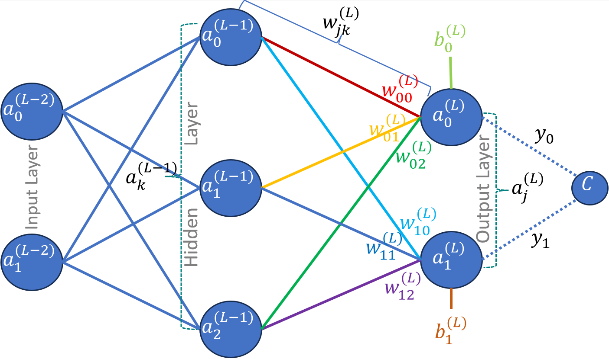

Referring to the network as shown in figure 1, we would like to determine the weights and the biases for the complete network such that the difference between the desired output and the network output. If this sounds familiar then it actually is, because this is what we did in gradient descent earlier, but in the case of a single function such the difference between the desired output and the function output was minimized. 

A neural network is also a function, but a little more complex than the functions that we dealt with earlier. The complexity arises due to the structure of a neural network consisting layers, with each layers containing multiple neurons and each layer connected with the other layer through weights. This is where back propagation comes into play. It helps us find the weights and biases for the next round of gradient descent. However, the principal to minimize the function and executing the gradient descent still stays exactly the same. 

                Fig. 1: Three Layers Neural Network

Gradient descent is given as follows

Repeat{

$\large{\theta_j := \theta_j - \alpha \frac{\partial}{\partial \theta_j} J(\theta)}$

}

However, instead of $\theta$ we would be optimizing for weights $w$ and biased $b$.

We need to find the gradient of the cost function of the entire network $\Delta C$, which is done using back propagation. The cost gradient vector is given as follows

$$\large{
\Delta C = \begin{bmatrix}
\frac{\partial C}{\partial w^{(1)}}
\\ 
\frac{\partial C}{\partial b^{(1)}}
\\ 
\vdots 
\\ 
\frac{\partial C}{\partial w^{(L)}}
\\ 
\frac{\partial C}{\partial b^{(L)}}
\end{bmatrix}
}
$$

where $C$ is the total cost, e.g., mean square error between desired output and the network output. $w^{(L)}$ is the weight matrix of layer $L$ and $b^{(L)}$ is the bias vector of layer $L$. Hence, the gradient vector, $\Delta C$, are the partial differentials of cost w.r.t. each weight in layer 1 and biases in layer 1 and the next layer, up until the last layer.

This is exactly how we performed the optimization in simple gradient descent, i.e., we find partial differentials the cost function $J(\theta)$ w.r.t. the independent variable $\theta$. In this case, we has the possibility of changing the weights $w$ and biases $b$.

## Computing the cost of a single training sample

We would be using the reference network as shown in figure 1 with two output neurons and 3 hidden layer neurons. Initial formulation would be based on this network to give a concrete example to the reader, however, the final derived formulas would be generic and could be used for network of any size.

Dataset consists of input-output pairs ${(\overrightarrow{x_i}, \overrightarrow{y_i})}$, where $\overrightarrow{x_i}$ is the input and $\overrightarrow{y_i}$ is the desired output of the network. The dataset consists of $N$ input-output pairs.

Let us first define some properties and notations for convenience. The cost of training a single example $C_0$ can be given as follows

$\large{C_0 = \sum_{j=0}^{n_L-1}(a_j^{(L)}-y_j)^2}$     (1)

where $a_j^{(L)}$ is the $j^{th}$ activation function of layer $L$ and $y_j$ is the $j^{th}$ desired output.

For convenience sake, lets assume the activation function is sigmoid (already implemented in [logistic regression](./LogisticRegression.md)). The activation of $j^{th}$ neuron in layer $L$ can be given as 

$\large{a_j^{(L)} = \sigma (w_{j0}^{(L)}a_0^{(L-1)} + w_{j1}^{(L)}a_1^{(L-1)} + w_{j2}^{(L)}a_2^{(L-1)} + b_j^{(L)})}$      (2)

Again for simplification we would name the expression inside the sigmoid as follow

$\large{z_j^{(L)} = w_{j0}^{(L)}a_0^{(L-1)} + w_{j1}^{(L)}a_1^{(L-1)} + w_{j2}^{(L)}a_2^{(L-1)} + b_j^{(L)}}$ 

or generically,

$\large{z_j^{(L)} = \sum_{k=0}^{n_{(L-1)}-1}w_{jk}^{L}a_k^{(L-1)} + b_j^{(L)}}$       (3)

Hence,

$\large{a_j^{L} = \sigma (z_j^L)}$      (4)

In order to visualize this in terms of the actual operations taking place, we can represent them as matrix operations

$$\large{
\begin{bmatrix}
z_0^L
\\ 
z_1^L
\end{bmatrix}
=
\begin{bmatrix}
w_{00}^{(L)} & w_{01}^{(L)} & w_{02}^{(L)}\\ 
w_{10}^{(L)} & w_{11}^{(L)} & w_{12}^{(L)}
\end{bmatrix}
\begin{bmatrix}
a_0^{(L-1)}\\ 
a_1^{(L-1)}\\ 
a_2^{(L-1)}
\end{bmatrix}
+
\begin{bmatrix}
b_0^{(L)}\\ 
b_1^{(L)}\\ 
b_2^{(L)}
\end{bmatrix}}
$$

### Optimizing w.r.t. the weights

As we already discussed we have the possibility of changing the weights and biases in the network. Hence, first we would like to see how the change in the weights affects the cost. Once, we have determined the change (or the gradient) due to the weights.

        Fig 2: Cost dependency chain w.r.t. weights of output layer 
                
As the cost does not *directly* depend on the weights, hence we will use the chain rule to determine the partial derivative of the cost w.r.t. the weights. Please refer to Fig. 2 to visualize how the chain rule is being applied. Cost $C_0$ depends on the activation output $a_j^{(L)}$, the activation output depends on the $z_j^{(L)}$, which in turn depends on the weight $w_{jk}^{(L)}$. The partial derivative of cost, $C_0$, w.r.t. to a single weight of layer $L$, $w_{jk}^{(L)}$ would be given as follows

$\huge{\frac{\partial C_0}{\partial w_{jk}^{(L)}} = \frac{\partial C_0}{\partial a_j^{(L)}} \frac{\partial a_j^{(L)}}{\partial z_j^{(L)}}\frac{\partial z_0^{(L)}}{\partial w_{jk}^{(L)}}}$    (5)

Now, we can solve each of the three partial derivatives. Using eq. 1, we can solve the first part as follows

$\large{\frac{\partial C_0}{\partial a_j^{(L)}}=\frac{\partial }{\partial a_j^{(L)}}\sum_{j=0}^{n_L-1}(a_j^{(L)}-y_j)^2 = 2(a_j^{(L)}-y_j)}$     (6)

This is trivially computable, as it is just twice the difference between the activation value and th desired output.

Next, part of the equation is simply the differential of activation function w.r.t. the $z$. However, to find a concrete solution, we will assume the used activation function is sigmoid (if any other function like ReLu is used, the differential needs to be replaced accordingly). Hence, the partial derivative would be as follows:

$\large{\frac{\partial a_0^{(L)}}{\partial z_j^{(L)}}=\frac{\partial }{\partial a_j^{(L)}}\left ( \frac{1}{1+e^{-z_j^{(L)})}} \right )=a_j^{(L)}(1-a_j^{(L)})}$     (7)

The derivative of logistic function is the [function multiplied by one minus the function](https://en.wikipedia.org/wiki/Logistic_function#Derivative). Again, the value in equation (6) is trivially computable.

Finally, we have the last part of the equation. It can easily be computed using the definition of $z$ from eq. (3). The derivative would be

$\large{\frac{\partial z_j^{(L)}}{\partial w_{jk}^{(L)}}=a_k^{(L-1)}}$      (8)

Combining the equation (5) - (7) we have a very simple solution for the cost function gradient w.r.t. the weights as follows 

$\large{\frac{\partial C_0}{\partial w_{jk}^{(L)}} =2(a_j^{(L)}-y_j) a_j^{(L)}(1-a_j^{(L)}) a_k^{(L-1)}}$       (9)

or generically, if we don't want to make assumption about the activation function:

$\large{\frac{\partial C_0}{\partial w_{jk}^{(L)}} =2(a_j^{(L)}-y_j) \frac{\partial a_0^{(L)}}{\partial z_j^{(L)}} a_k^{(L-1)}}$       (10)

However, we will stick to eq. (9) for further derivation to keep the results concrete.

We will introduce an additional notation here as follow, as it will be very useful later on. 

$\large{\delta_j^{(L)}=\frac{\partial C_0}{\partial a_j^{(L)}} \frac{\partial a_j^{(L)}}{\partial z_j^{(L)}}}$

Hence,

$\large{\frac{\partial C_0}{\partial w_{jk}^{(L)}} =\delta_j^{(L)} a_k^{(L-1)}}$

Lastly, we made an assumption initially that the cost would be computed based on a single sample. However, we can have $m$ number of samples and the cost would be the average of the costs for all the samples, which can be given as follows

$\large{C = \frac{1}{m}\sum_{i=0}^{m-1}C_i}$

The partial derivative would be computed as follow

$\large{\frac{\partial C}{\partial w^{(L)}} = \frac{1}{m}\sum_{i=0}^{m-1}\frac{\partial C_i}{\partial w^{(L)}}}$