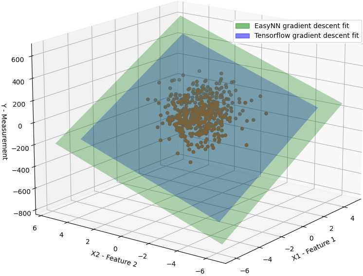
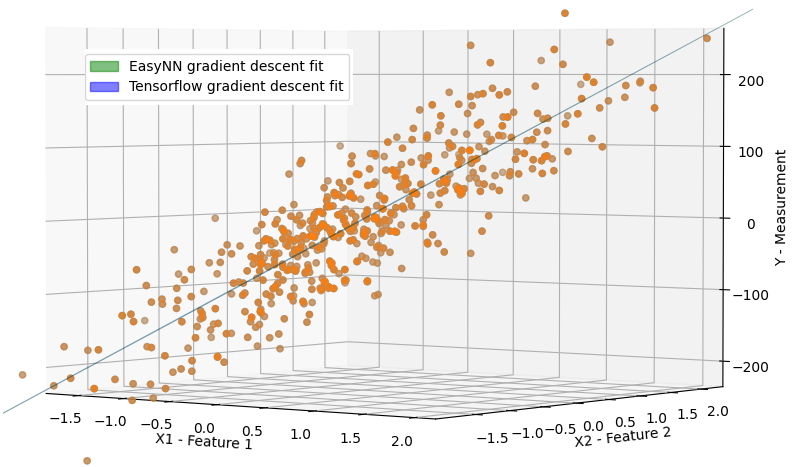
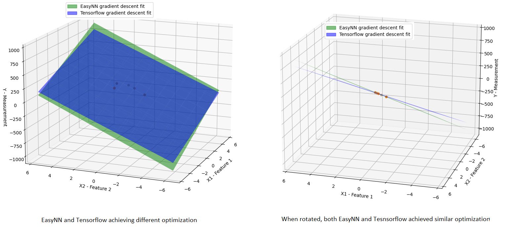
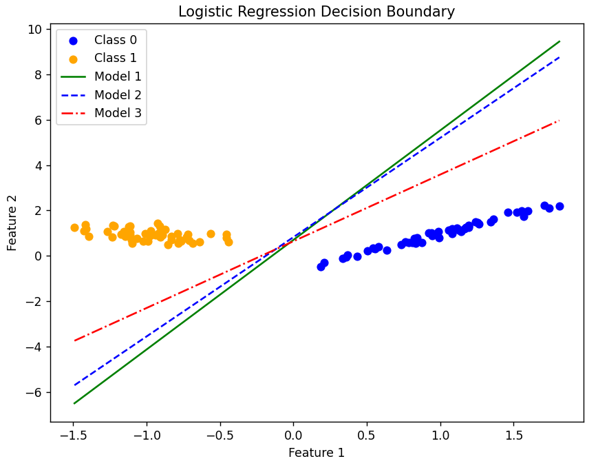
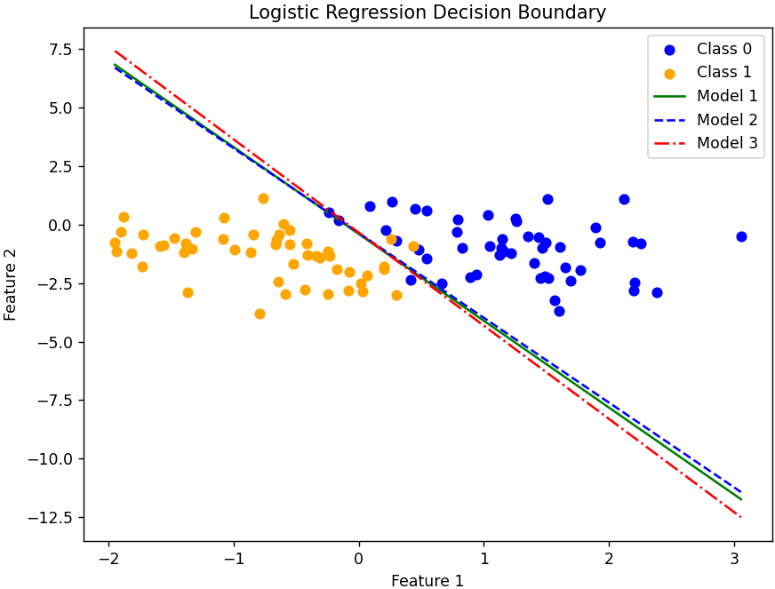
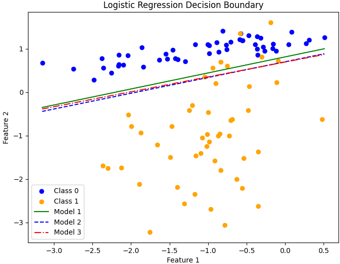
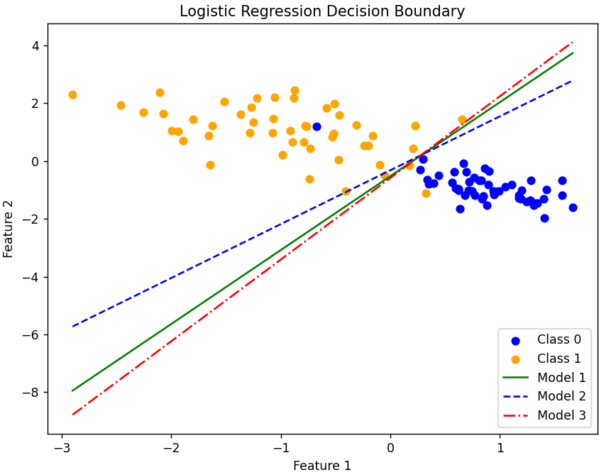

# Gradient Descent Evaluation

All the effort we have put so far come down to this. This is not just the evaluation of gradient descent but also serves to show the flexibility, scalability, performance and easy of use of EasyNN.

## Testing strategy

The biggest obstacle I faced so far in developing EasyNN was the ability to test everything that I was implementing. I didn't have readily available data that I could use to test various algorithms that I had implemented, e.g., regressions, cost functions and gradient descent. Even if I could find some data or generate the data to test the algorithms, it was still very time consuming and cumbersome. Moreover, I also wanted to test the results of EasyNN against the standard implementations like TensorFlow.

I found out that there are python libraries like sklearn that I can use to generate data and TensorFlow was also available in Python to generate the reference results. Hence, I implemented an embedded python interpreter (EasyNNPyPlugin) to be able to run python scripts directly from my test code to generate data and reference results. The details about the EasyNNPyPlugin is out of the scope. However, it is part of the same visual studio solution that contains EasyNN.

EasyNNPyPlugin has allowed me to write tests that generate dynamic data using python libraries, generate results from EasyNN algorithms that I want to test and generate reference results from well established libraries like TensorFlow to compare the EasyNN results with.

Some of the earlier tests are based on static data, but since I wrote EasyNNPyPlugin all the new tests are based on dynamic data and generate data and reference results from Python libraries. Hence, we will see references to the EasyNNPyPlugin method calls but these will be self explanatory.

## Linear Regression with Gradient Descent 

Here is a very simple example of testing gradient descent if it could optimize linear regression model containing only one feature

```cpp
TEST_METHOD(TestGradientDescentEvaluation1Feature)
{
1    EasyNN::CostFunctionMSE costFunction{ std::make_unique<EasyNN::LinearRegression>() };
2    std::vector<double> parameters{ 0, 0};
3    std::vector<std::vector<double>> x = { {0}, {1}, {2}, {3}, {4} };
4    std::vector<double> y = { 1, 3, 5, 7, 9};
5
6    runGD(x, y, costFunction, 0.1, 1.0E-9, parameters);
7
8    std::vector<double> expectedParameters{1, 2};
9    Assert::IsTrue(std::equal(std::begin(parameters), std::end(parameters), std::begin(expectedParameters), 
10        [](double a, double b) {
11            return std::abs(a - b) < 0.001; 
12        }));
}
```

We define a cost function for linear regression (line 1), instantiate the parameters with zeros (lines 2), create a feature matrix with 5 samples of data with each row containing a feature vector consisting of a single feature value (line 3), next we provide the measured values (line 4). Next, we run gradient descent (runGD is a simple helper function in EasyNN tests project) passing it the feature matrix, measured values, cost function, learning rate of 0.1, stopping threshold of 1.0E-9 and the model parameters (line 6). The expected model parameters are [1, 2] (line 8). Finally, we compare the model parameters returned by GD and the expected parameters (std::abs(a - b) < 0.001 is to account for precision errors).

### Generating dynamic data and comparing results with TensorFlow

```cpp
TEST_METHOD(TestGradientDescentEvaluation2FeaturesLiveData) {
1     EasyNN::CostFunctionMSE costFunction{std::make_unique<EasyNN::LinearRegression>()};
2     std::vector<double> parameters { 0.0, 0.0, 0.0 };
3     std::vector<std::vector<double>> X;
4     std::vector<double> y;
5     EasyNNPyPlugin::DataChannel::getRegressionData(X, y, 100, 2, 100);
6
7     runGD(X, y, costFunction, 0.07, 1.0E-9, parameters);
8     auto expectedParameters = EasyNNPyPlugin::Algorithms::RunGD(X, y, 3);
9
10    EasyNNPyPlugin::Plots::CompareHypothesis(X, y, parameters, expectedParameters);
11    auto MSE = EasyNN::CostFunctionMSE{ std::make_unique<EasyNN::LinearRegression>() }.evaluate(X, y, parameters);
12    auto MSEExpected = EasyNN::CostFunctionMSE{ std::make_unique<EasyNN::LinearRegression>() }.evaluate(X, y, expectedParameters);
13    Assert::IsTrue(abs(abs(MSE - MSEExpected) / MSEExpected) < 0.001);
}
```

The test above is exactly the same as the last test, however, the key difference is that it uses EasyNNPyPlugin to retrieve dynamically generated data (line 5). The parameters to getRegressionData() are the feature matrix, measurement vector, number of samples, number of features and the dispersion of the data. We get the EasyNN GD results in line 7. Line 8 fetches the references results from TensorFlow. Line 10 also shows that we can use EasyNNPyPlugin to plot the graphs to visualize the results.

The linear regression fits achieved through EasyNN's gradient descent method are remarkably similar to those obtained using TensorFlow. In fact, the two are practically indistinguishable from one another. Thanks to EasyNNPyInterpreter we can also visualize these results now. The following figure shows the fit of both EasyNN and TensorFlow from the above test


        EasyNN vs TensorFlow Linear Regression Gradient Fit

The figure shows the plane represented by the model to fit all the samples of the data. The two planes are literally the same, hence I had to make one smaller than the other to be able to easily see the other.

Here is a zoomed-in side view of the same graph, both the planes literally make a single line


        EasyNN vs TensorFlow Linear Regression Gradient Fit


In rare instances where a minimal dataset of just 5 samples is employed, a slight divergence between EasyNN and TensorFlow optimizations may arise. The subsequent figure captures such an infrequent scenario (achieved after multiple trial runs), where a linear hypothesis is approximated through gradient descent optimization using only two features and five samples:



The green and blue planes illustrate the linear approximations achieved by EasyNN and TensorFlow through gradient descent optimization, respectively. Yet, upon rotating the graph, it becomes evident that both methods achieve a comparable level of approximation, a fact reinforced by the Mean Squared Error (MSE) analysis.

## Logistic Regression with Gradient Descent

Logistic regression is used for classification. In order to test EasyNN implementation of logistic regression and GD optimization of logistic regression I again used dynamic data approach and compare the results from Easy with TensorFlow and sklearn python libraries. I am really happy to state that the results from EasyNN are at least as good as TensorFlow results or arguably sometimes slightly better than TensorFlow results. The reason for **arguably better** results is that classification problem are different than the linear regression problems and though I sometimes have observed EasyNN classification to perform better by up to 2% then TensorFlow results, but it may not necessarily be a good thing as it could also be a result of slight overfitting or it could come down to the various TensorFlow parameters, like epochs etc.. But, in general the classification of both EasyNN and TensorFlow is identical in most of the cases.

A typical GD logistic regression test for EasyNN would look as follows

```cpp
TEST_METHOD(TestGradientDescentEvaluationLogisticRegression)
{
1     std::vector<std::vector<double>> X;
2     std::vector<double> y;
3
4     EasyNNPyPlugin::DataChannel::getClassificationData(X, y, 100, 2, 0, 1);
5
6    EasyNN::CostFuntionLogistic costFunction{ std::make_unique<EasyNN::LogisticRegression>()};
7    std::vector<double> parameters{ 0, 0, 0};
8    runGD(X, y, costFunction, 0.3, 1.0E-5, parameters);
9
10    double correctPercentage = correctClassificationPercentage(X, y, parameters);
11
12    std::vector<double> expectedParameters = EasyNNPyPlugin::Algorithms::FitLogisticRegression(X, y);
13    std::vector<double> expectedParametersTF = EasyNNPyPlugin::Algorithms::FitLogisticRegressionTF(X, y);
14
15    double expParamPercentage = correctClassificationPercentage(X, y, expectedParameters);
16    double expParamPercentageTF = correctClassificationPercentage(X, y, expectedParametersTF);
17
18    EasyNNPyPlugin::Plots::PlotClassificationData(X, y, parameters, expectedParameters, expectedParametersTF);
19
20    Assert::IsTrue(std::abs(correctPercentage - expParamPercentageTF) < 2.0); 
}
```

This test is similar to linear regression tests. We fetch the data dynamically from python sklearn library (line 4). The method getClassificationData(...) take the input of feature matrix, measured output, number of samples, number of features, redundant features and clusters per feature. In this specific case we get 100 data points divided in two clusters. Next, we instantiate EasyNN logistic regression (line 6). EasyNN GD is fit on the data (line 8). A helper method is used to find the correct classification percentage (line 10). Next, we determine the classification using sklearn and TensorFlow libraries (line 12 and 13). The respective percentages are determined (line 15, 16). The results are plotted (line 18) and checked to make sure EasyNN classification is with 2% of TensorFlow classification benchmark.

In the following figure green line represents EasyNN classification line, blue line represents TensorFlow model and red line represents sklearn model.



A very simple classification problem. All three models perform equally well and none is arguably better than the other in this case, though EasyNN model tends to be closer to TensorFlow estimate.



Slightly tighter optimal solution range as compared to earlier example. EasyNN takes middle ground but still closer to TensorFlow. The performance of the models are still the same. None seems to be arguably better than the other.



This is interesting and one of the examples where EasyNN performance better than both TensorFlow and sklearn and it has distanced itself from Tensorflow this time. EasyNN achieves 94% correct classification and the other two achieve 92%.



Again a very narrow optimization point, but both EasyNN and sklearn perform better than TensorFlow.

### Comments

It is important to note that the intention is not to prove that EasyNN performs better than TensorFlow. The observed difference in performance could be due to various configuration parameters and is both rare and small. I am incredibly pleased that the results of EasyNN are comparable to those of TensorFlow, which is an industry standard. This has increased my confidence in the design and implementation of EasyNN.

## Important Links
* [Back: Regularization](./Regularization.md).
* [Go back to Implementing Neural Networks in C++](./index.md)

## Index

**Linear Regression**

[Linear Regression](./LinearRegression.md)

[Linear Regression Cost Function](./CostFunctionLinearRegression.md)

**Logistic Regression**

[Logistic Regression](./LogisticRegression.md)

[Logistic Regression Cost Function](./CostFunctionLogisticRegression.md)

**Regularization**

[Regularization](./Regularization.md)

**Gradient Descent**

[Gradient Descent](./GradientDescent.md)

[Gradient Descent Evaluation](./GradientDescentTest.md)